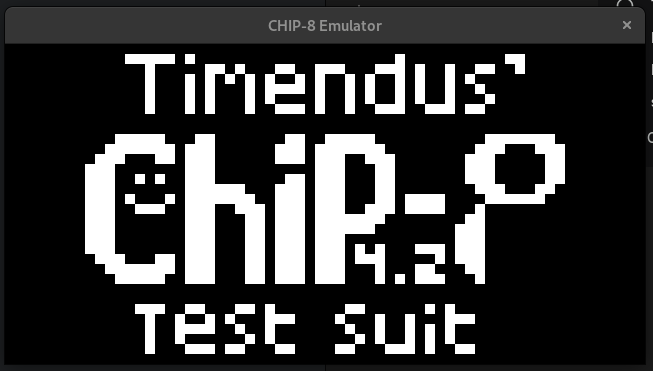
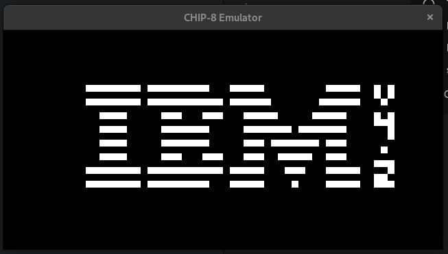
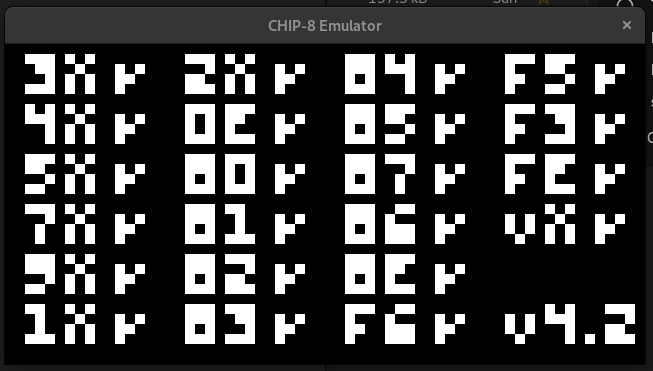
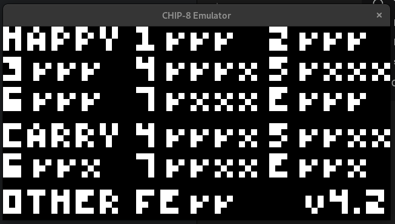

# Testing
Project relies on different types of testing for different purposes:
- **Unit Tests**: Used for testing small units of code. Perfect for testing individual opcode handler functions.
- **Integration Tests**: Used to test how several pieces of the system work together. I will use it to test the interactions between memory, CPU, and registers.
- **End-to-End Tests**: Running the final executable as a whole. The project will use [Timendus/chip8-test-suite](https://github.com/Timendus/chip8-test-suite) and add screenshots of performed tests.

# Test Results

## E2E test 
Here are results of tests from [Timendus/chip8-test-suite](https://github.com/Timendus/chip8-test-suite) ROMs.

### CHIP8 Logo
1-chip8-logo.ch8

### IBM Logo
2-ibm-logo.ch8

### Corax+
3-corax+.ch8

### Flags
4-flags.ch8

## TODO:
- Pick a framework/library for unit testing
- Modify the Makefile to automate common testing workflows
- ~~Find ROMs that are accepted as standard for CHIP8 emulator testing and perform the tests~~

